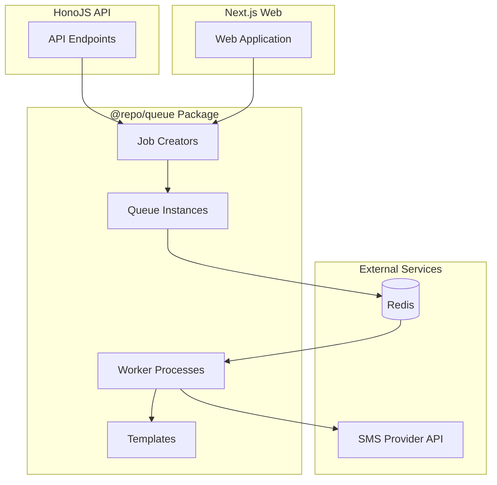

# Design Document

## Overview

The notification queue system is implemented as a shared package (`@repo/queue`) in the monorepo that provides a scalable, type-safe infrastructure for asynchronous notification delivery. The system uses BullMQ (a Redis-based queue) to handle SMS notifications with a clear path for adding email and other notification types.

The architecture separates concerns into distinct layers:
- **Queues**: Define and configure BullMQ queue instances
- **Workers**: Process jobs from queues and execute notification logic
- **Jobs**: Type-safe job creation utilities for each template
- **Templates**: Message formatting logic with typed data schemas
- **Config**: Centralized Redis and queue configuration

This design allows the HonoJS API to quickly queue notifications and return responses while workers process notifications asynchronously in the background.

## Architecture

### High-Level Architecture



### Package Structure

```
packages/
└── queue/
    ├── package.json
    ├── tsconfig.json
    ├── README.md                    # Main documentation
    ├── docs/
    │   ├── getting-started.md       # Quick start guide
    │   ├── architecture.md          # Architecture overview
    │   ├── usage.md                 # Usage examples
    │   ├── adding-templates.md      # Guide for adding new templates
    │   ├── deployment.md            # Deployment guide
    │   └── troubleshooting.md       # Common issues and solutions
    ├── src/
    │   ├── index.ts                 # Main exports
    │   ├── config/
    │   │   ├── index.ts             # Export all configs
    │   │   ├── redis.ts             # Redis connection config
    │   │   └── queue-options.ts     # Default queue options
    │   ├── types/
    │   │   └── index.ts             # Shared types
    │   ├── queues/
    │   │   ├── index.ts             # Export all queues
    │   │   ├── sms.queue.ts         # SMS queue instance
    │   │   └── email.queue.ts       # Future: Email queue
    │   ├── workers/
    │   │   ├── index.ts             # Export worker starter
    │   │   ├── sms.worker.ts        # SMS worker
    │   │   └── email.worker.ts      # Future: Email worker
    │   ├── jobs/
    │   │   ├── index.ts             # Export all job creators
    │   │   └── sms/
    │   │       ├── index.ts         # Export SMS job creators
    │   │       ├── welcome.job.ts   # Welcome SMS job creator
    │   │       ├── otp.job.ts       # OTP SMS job creator
    │   │       └── notification.job.ts  # Generic notification
    │   └── templates/
    │       ├── index.ts             # Export all templates
    │       └── sms/
    │           ├── index.ts         # Export SMS templates
    │           ├── welcome.ts       # Welcome message template
    │           ├── otp.ts           # OTP message template
    │           └── notification.ts  # Generic notification template
```

### Data Flow

1. **Job Creation**: API/Web app calls a job creator function (e.g., `createWelcomeSMSJob()`)
2. **Queue Addition**: Job creator adds typed job data to the appropriate BullMQ queue
3. **Job Storage**: BullMQ stores job in Redis with retry configuration
4. **Worker Processing**: Worker picks up job from Redis queue
5. **Template Rendering**: Worker uses template to format message with job data
6. **Notification Sending**: Worker calls SMS provider API
7. **Completion/Retry**: Job marked complete or retried on failure

## Components and Interfaces

### 1. Configuration Layer

#### Redis Configuration (`config/redis.ts`)

```typescript
import { ConnectionOptions } from 'bullmq';

export interface RedisConfig {
  host: string;
  port: number;
  password?: string;
  db?: number;
  maxRetriesPerRequest: number | null;
}

export const getRedisConfig = (): RedisConfig => {
  return {
    host: process.env.REDIS_HOST || 'localhost',
    port: parseInt(process.env.REDIS_PORT || '6379'),
    password: process.env.REDIS_PASSWORD,
    db: parseInt(process.env.REDIS_DB || '0'),
    maxRetriesPerRequest: null, // Required for BullMQ
  };
};

export const getRedisConnection = (): ConnectionOptions => {
  return {
    ...getRedisConfig(),
  };
};
```

#### Queue Options (`config/queue-options.ts`)

```typescript
import { QueueOptions, WorkerOptions } from 'bullmq';

export const defaultQueueOptions: QueueOptions = {
  defaultJobOptions: {
    attempts: 3,
    backoff: {
      type: 'exponential',
      delay: 2000, // Start with 2 seconds
    },
    removeOnComplete: {
      age: 24 * 3600, // Keep completed jobs for 24 hours
      count: 1000, // Keep last 1000 completed jobs
    },
    removeOnFail: {
      age: 7 * 24 * 3600, // Keep failed jobs for 7 days
    },
  },
};

export const defaultWorkerOptions: Partial<WorkerOptions> = {
  concurrency: 5, // Process 5 jobs concurrently per worker
  limiter: {
    max: 10, // Max 10 jobs
    duration: 1000, // Per second
  },
};
```

### 2. Type Definitions (`types/index.ts`)

```typescript
// Base job data interface
export interface BaseJobData {
  id: string;
  timestamp: number;
}

// SMS specific types
export interface SMSRecipient {
  phoneNumber: string;
  name?: string;
}

export interface WelcomeSMSData extends BaseJobData {
  type: 'welcome';
  recipient: SMSRecipient;
  userName: string;
}

export interface OTPSMSData extends BaseJobData {
  type: 'otp';
  recipient: SMSRecipient;
  code: string;
  expiryMinutes: number;
}

export interface NotificationSMSData extends BaseJobData {
  type: 'notification';
  recipient: SMSRecipient;
  message: string;
  metadata?: Record<string, unknown>;
}

// Discriminated union for all SMS job types
export type SMSJobData = WelcomeSMSData | OTPSMSData | NotificationSMSData;

// Template result
export interface TemplateResult {
  message: string;
  recipient: SMSRecipient;
}

// Job creation options
export interface JobOptions {
  priority?: number;
  delay?: number;
  jobId?: string;
}
```

### 3. Queue Layer

#### SMS Queue (`queues/sms.queue.ts`)

```typescript
import { Queue } from 'bullmq';
import { getRedisConnection } from '../config/redis';
import { defaultQueueOptions } from '../config/queue-options';
import type { SMSJobData } from '../types';

export const SMS_QUEUE_NAME = 'sms-notifications';

export const smsQueue = new Queue<SMSJobData>(
  SMS_QUEUE_NAME,
  {
    connection: getRedisConnection(),
    ...defaultQueueOptions,
  }
);

// Graceful shutdown
export const closeSMSQueue = async () => {
  await smsQueue.close();
};
```

### 4. Template Layer

#### Template Interface

Each template exports:
- A TypeScript type for its data
- A function that takes data and returns formatted message

#### Welcome SMS Template (`templates/sms/welcome.ts`)

```typescript
import type { WelcomeSMSData, TemplateResult } from '../../types';

export const renderWelcomeSMS = (data: WelcomeSMSData): TemplateResult => {
  const message = `Welcome to our platform, ${data.userName}! We're excited to have you on board. Get started by exploring your dashboard.`;
  
  return {
    message,
    recipient: data.recipient,
  };
};
```

#### OTP SMS Template (`templates/sms/otp.ts`)

```typescript
import type { OTPSMSData, TemplateResult } from '../../types';

export const renderOTPSMS = (data: OTPSMSData): TemplateResult => {
  const message = `Your verification code is: ${data.code}. This code will expire in ${data.expiryMinutes} minutes. Do not share this code with anyone.`;
  
  return {
    message,
    recipient: data.recipient,
  };
};
```

#### Notification SMS Template (`templates/sms/notification.ts`)

```typescript
import type { NotificationSMSData, TemplateResult } from '../../types';

export const renderNotificationSMS = (data: NotificationSMSData): TemplateResult => {
  return {
    message: data.message,
    recipient: data.recipient,
  };
};
```

### 5. Job Creation Layer

#### Welcome SMS Job Creator (`jobs/sms/welcome.job.ts`)

```typescript
import { smsQueue } from '../../queues/sms.queue';
import type { WelcomeSMSData, SMSRecipient, JobOptions } from '../../types';

export interface CreateWelcomeSMSJobParams {
  recipient: SMSRecipient;
  userName: string;
}

export const createWelcomeSMSJob = async (
  params: CreateWelcomeSMSJobParams,
  options?: JobOptions
) => {
  const jobData: WelcomeSMSData = {
    type: 'welcome',
    id: options?.jobId || crypto.randomUUID(),
    timestamp: Date.now(),
    recipient: params.recipient,
    userName: params.userName,
  };

  const job = await smsQueue.add('welcome-sms', jobData, {
    priority: options?.priority,
    delay: options?.delay,
    jobId: options?.jobId,
  });

  return {
    jobId: job.id,
    queueName: smsQueue.name,
  };
};
```

#### OTP SMS Job Creator (`jobs/sms/otp.job.ts`)

```typescript
import { smsQueue } from '../../queues/sms.queue';
import type { OTPSMSData, SMSRecipient, JobOptions } from '../../types';

export interface CreateOTPSMSJobParams {
  recipient: SMSRecipient;
  code: string;
  expiryMinutes: number;
}

export const createOTPSMSJob = async (
  params: CreateOTPSMSJobParams,
  options?: JobOptions
) => {
  const jobData: OTPSMSData = {
    type: 'otp',
    id: options?.jobId || crypto.randomUUID(),
    timestamp: Date.now(),
    recipient: params.recipient,
    code: params.code,
    expiryMinutes: params.expiryMinutes,
  };

  const job = await smsQueue.add('otp-sms', jobData, {
    priority: options?.priority || 1, // OTP has higher priority
    delay: options?.delay,
    jobId: options?.jobId,
  });

  return {
    jobId: job.id,
    queueName: smsQueue.name,
  };
};
```

### 6. Worker Layer

#### SMS Worker (`workers/sms.worker.ts`)

```typescript
import { Worker, Job } from 'bullmq';
import { getRedisConnection } from '../config/redis';
import { defaultWorkerOptions } from '../config/queue-options';
import { SMS_QUEUE_NAME } from '../queues/sms.queue';
import type { SMSJobData } from '../types';
import { renderWelcomeSMS } from '../templates/sms/welcome';
import { renderOTPSMS } from '../templates/sms/otp';
import { renderNotificationSMS } from '../templates/sms/notification';

import { createSMSProvider } from '../providers/sms/factory';
import type { SMSProvider } from '../providers/sms/interface';

// Initialize SMS provider based on environment
const smsProvider: SMSProvider = createSMSProvider();

// Process SMS jobs
const processSMSJob = async (job: Job<SMSJobData>) => {
  console.log(`Processing SMS job ${job.id} of type ${job.data.type}`);

  let templateResult;

  // Route to appropriate template based on job type
  switch (job.data.type) {
    case 'welcome':
      templateResult = renderWelcomeSMS(job.data);
      break;
    case 'otp':
      templateResult = renderOTPSMS(job.data);
      break;
    case 'notification':
      templateResult = renderNotificationSMS(job.data);
      break;
    default:
      // TypeScript exhaustiveness check
      const _exhaustive: never = job.data;
      throw new Error(`Unknown SMS job type: ${(_exhaustive as any).type}`);
  }

  // Send SMS via provider
  const result = await smsProvider.send(
    templateResult.recipient.phoneNumber,
    templateResult.message
  );

  if (!result.success) {
    throw new Error(`SMS send failed: ${result.error}`);
  }

  console.log(`Successfully sent SMS job ${job.id} via ${result.provider}, messageId: ${result.messageId}`);
  
  return { 
    success: true, 
    jobId: job.id,
    messageId: result.messageId,
    provider: result.provider,
  };
};

// Create and export worker
export const createSMSWorker = () => {
  const worker = new Worker<SMSJobData>(
    SMS_QUEUE_NAME,
    processSMSJob,
    {
      connection: getRedisConnection(),
      ...defaultWorkerOptions,
    }
  );

  // Event listeners for monitoring
  worker.on('completed', (job) => {
    console.log(`SMS job ${job.id} completed`);
  });

  worker.on('failed', (job, err) => {
    console.error(`SMS job ${job?.id} failed:`, err);
  });

  worker.on('error', (err) => {
    console.error('SMS worker error:', err);
  });

  return worker;
};

// Graceful shutdown
export const closeSMSWorker = async (worker: Worker) => {
  await worker.close();
};
```

### 7. Main Package Exports (`index.ts`)

```typescript
// Export job creators
export * from './jobs/sms';

// Export types
export * from './types';

// Export queue instances (for monitoring/admin)
export { smsQueue, closeSMSQueue } from './queues/sms.queue';

// Export worker creators (for running workers)
export { createSMSWorker, closeSMSWorker } from './workers/sms.worker';

// Export config (for testing/debugging)
export { getRedisConfig, getRedisConnection } from './config/redis';
```

## Data Models

### Job Data Models

All job data follows a discriminated union pattern with a `type` field for type safety:

```typescript
type SMSJobData = 
  | { type: 'welcome', ... }
  | { type: 'otp', ... }
  | { type: 'notification', ... }
```

This allows TypeScript to narrow types in switch statements and provides compile-time safety.

### Database Models

The queue system doesn't require additional PostgreSQL tables as BullMQ stores all job data in Redis. However, you may want to track notification history:

```typescript
// Optional: Notification history table (Drizzle schema)
export const notificationHistory = pgTable('notification_history', {
  id: uuid('id').primaryKey().defaultRandom(),
  userId: uuid('user_id').references(() => users.id),
  type: varchar('type', { length: 50 }).notNull(), // 'sms', 'email'
  template: varchar('template', { length: 50 }).notNull(), // 'welcome', 'otp', etc.
  recipient: varchar('recipient', { length: 255 }).notNull(),
  status: varchar('status', { length: 20 }).notNull(), // 'sent', 'failed'
  jobId: varchar('job_id', { length: 255 }),
  sentAt: timestamp('sent_at').defaultNow(),
  metadata: jsonb('metadata'),
});
```

## Error Handling

### Retry Strategy

- **Attempts**: 3 attempts per job
- **Backoff**: Exponential backoff starting at 2 seconds (2s, 4s, 8s)
- **Failed Jobs**: Kept for 7 days for debugging
- **Completed Jobs**: Kept for 24 hours (last 1000 jobs)

### Error Types and Handling

1. **Redis Connection Errors**
   - Log error with context
   - Throw to prevent job processing without Redis
   - Application should handle gracefully (queue operations will fail)

2. **Template Rendering Errors**
   - Caught in worker
   - Job marked as failed
   - Error logged with job data
   - Will retry based on retry policy

3. **SMS Provider Errors**
   - Caught in worker
   - Job marked as failed
   - Error logged with provider response
   - Will retry based on retry policy

4. **Validation Errors**
   - TypeScript prevents most validation errors at compile time
   - Runtime validation can be added using Zod schemas
   - Invalid jobs should fail immediately without retry

### Monitoring and Logging

```typescript
// Worker event handlers provide monitoring hooks
worker.on('completed', (job) => {
  // Log to monitoring service
  // Update database notification history
});

worker.on('failed', (job, err) => {
  // Log to error tracking service (e.g., Sentry)
  // Alert on repeated failures
  // Update database notification history
});

worker.on('progress', (job, progress) => {
  // Track job progress for long-running jobs
});
```

## Testing Strategy

### Unit Tests

1. **Template Tests**
   - Test each template renders correctly with valid data
   - Test template handles edge cases (long names, special characters)
   - Verify output format

2. **Job Creator Tests**
   - Mock BullMQ queue
   - Verify job data structure
   - Test job options (priority, delay)
   - Verify job ID generation

3. **Configuration Tests**
   - Test Redis config reads environment variables
   - Test default values
   - Test queue options structure

### Integration Tests

1. **Queue Integration**
   - Test job can be added to real Redis instance
   - Test job can be retrieved from queue
   - Test job data integrity

2. **Worker Integration**
   - Test worker picks up jobs from queue
   - Test worker processes jobs correctly
   - Test worker handles failures and retries
   - Mock SMS provider to avoid actual sends

3. **End-to-End Tests**
   - Test complete flow: create job → worker processes → SMS sent
   - Test retry behavior with failing provider
   - Test concurrent job processing

### Testing Utilities

```typescript
// Test helper to create test queue with isolated Redis DB
export const createTestQueue = () => {
  return new Queue('test-queue', {
    connection: {
      ...getRedisConfig(),
      db: 15, // Use separate DB for tests
    },
  });
};

// Test helper to wait for job completion
export const waitForJobCompletion = async (jobId: string, queue: Queue) => {
  const job = await queue.getJob(jobId);
  await job.waitUntilFinished(queue.events);
  return job;
};
```

## Deployment Considerations

### Worker Deployment

Workers can be deployed in two ways:

1. **Separate Process** (Recommended for production)
   - Create a dedicated worker service/container
   - Scale workers independently from API
   - Better resource isolation

```typescript
// workers/start.ts
import { createSMSWorker } from '@repo/queue';

const worker = createSMSWorker();

// Graceful shutdown
process.on('SIGTERM', async () => {
  await worker.close();
  process.exit(0);
});
```

2. **Same Process as API** (Simpler for development)
   - Start worker in API server
   - Easier local development
   - Less infrastructure complexity

```typescript
// In HonoJS app
import { createSMSWorker } from '@repo/queue';

const worker = createSMSWorker();
// API continues to run
```

### Environment Variables

```bash
# Redis Configuration
REDIS_HOST=localhost
REDIS_PORT=6379
REDIS_PASSWORD=your-password
REDIS_DB=0

# SMS Provider (example for Twilio)
SMS_PROVIDER=twilio
TWILIO_ACCOUNT_SID=your-sid
TWILIO_AUTH_TOKEN=your-token
TWILIO_PHONE_NUMBER=your-number
```

### Scaling Considerations

- **Horizontal Scaling**: Run multiple worker instances for higher throughput
- **Queue Partitioning**: Use separate queues for different priorities
- **Rate Limiting**: Configure worker limiter based on SMS provider limits
- **Redis Persistence**: Enable Redis persistence (AOF/RDB) for job durability

## Future Extensibility

### Adding Email Notifications

To add email support, follow the same pattern:

1. Create `queues/email.queue.ts`
2. Create `workers/email.worker.ts`
3. Create templates in `templates/email/`
4. Create job creators in `jobs/email/`
5. Add email types to `types/index.ts`
6. Export from main `index.ts`

The architecture ensures no changes to existing SMS code are needed.

### Adding New SMS Templates

To add a new SMS template:

1. Add type to `types/index.ts` discriminated union
2. Create template in `templates/sms/new-template.ts`
3. Create job creator in `jobs/sms/new-template.job.ts`
4. Add case to worker switch statement
5. Export from respective index files

### Provider Abstraction

The system supports multiple SMS providers through a common interface:

#### Provider Interface (`providers/sms/interface.ts`)

```typescript
export interface SMSResult {
  success: boolean;
  messageId?: string;
  error?: string;
  provider: string;
}

export interface SMSProvider {
  send(phoneNumber: string, message: string): Promise<SMSResult>;
  getName(): string;
}
```

#### Salum SMS Provider (`providers/sms/salum.provider.ts`)

```typescript
import type { SMSProvider, SMSResult } from './interface';

interface SalumConfig {
  apiKey: string;
  partnerId: string;
  shortcode: string;
  apiUrl?: string;
}

interface SalumResponse {
  responses: Array<{
    'respose-code': number; // Note: API has typo "respose"
    'response-description': string;
    mobile: string;
    messageid?: number;
    networkid?: string;
  }>;
}

export class SalumSMSProvider implements SMSProvider {
  private config: SalumConfig;

  constructor(config?: Partial<SalumConfig>) {
    this.config = {
      apiKey: config?.apiKey || process.env.SALUM_API_KEY || '',
      partnerId: config?.partnerId || process.env.SALUM_PARTNER_ID || '',
      shortcode: config?.shortcode || process.env.SALUM_SHORTCODE || 'BURETI-TEA',
      apiUrl: config?.apiUrl || 'https://sms.salum.co.ke/api/services/sendsms/',
    };

    if (!this.config.apiKey || !this.config.partnerId) {
      throw new Error('Salum SMS provider requires apiKey and partnerId');
    }
  }

  getName(): string {
    return 'salum';
  }

  async send(phoneNumber: string, message: string): Promise<SMSResult> {
    try {
      // Normalize phone number to 254 format
      const normalizedPhone = this.normalizePhoneNumber(phoneNumber);

      const requestBody = {
        apikey: this.config.apiKey,
        partnerID: this.config.partnerId,
        message: message,
        shortcode: this.config.shortcode,
        mobile: normalizedPhone,
      };

      const response = await fetch(this.config.apiUrl, {
        method: 'POST',
        headers: {
          'Content-Type': 'application/json',
        },
        body: JSON.stringify(requestBody),
      });

      if (!response.ok) {
        throw new Error(`HTTP error! status: ${response.status}`);
      }

      const data: SalumResponse = await response.json();

      // Check if we have responses
      if (!data.responses || data.responses.length === 0) {
        return {
          success: false,
          error: 'No response from Salum API',
          provider: this.getName(),
        };
      }

      const result = data.responses[0];

      // Salum uses 200 as success code
      if (result['respose-code'] === 200) {
        return {
          success: true,
          messageId: result.messageid?.toString(),
          provider: this.getName(),
        };
      } else {
        return {
          success: false,
          error: result['response-description'] || 'Unknown error',
          provider: this.getName(),
        };
      }
    } catch (error) {
      return {
        success: false,
        error: error instanceof Error ? error.message : 'Unknown error',
        provider: this.getName(),
      };
    }
  }

  /**
   * Normalize phone number to Kenyan format (254XXXXXXXXX)
   * Handles: 0712345678, +254712345678, 254712345678, 712345678
   */
  private normalizePhoneNumber(phone: string): string {
    // Remove any spaces, dashes, or parentheses
    let cleaned = phone.replace(/[\s\-\(\)]/g, '');

    // Remove leading + if present
    if (cleaned.startsWith('+')) {
      cleaned = cleaned.substring(1);
    }

    // If starts with 0, replace with 254
    if (cleaned.startsWith('0')) {
      cleaned = '254' + cleaned.substring(1);
    }

    // If doesn't start with 254 and is 9 digits, add 254
    if (!cleaned.startsWith('254') && cleaned.length === 9) {
      cleaned = '254' + cleaned;
    }

    return cleaned;
  }
}
```

#### Mock SMS Provider (`providers/sms/mock.provider.ts`)

```typescript
import type { SMSProvider, SMSResult } from './interface';

export class MockSMSProvider implements SMSProvider {
  getName(): string {
    return 'mock';
  }

  async send(phoneNumber: string, message: string): Promise<SMSResult> {
    console.log(`[MOCK SMS] Sending to ${phoneNumber}:`);
    console.log(`[MOCK SMS] Message: ${message}`);
    
    // Simulate network delay
    await new Promise(resolve => setTimeout(resolve, 100));

    return {
      success: true,
      messageId: `mock-${Date.now()}-${Math.random().toString(36).substring(7)}`,
      provider: this.getName(),
    };
  }
}
```

#### Provider Factory (`providers/sms/factory.ts`)

```typescript
import type { SMSProvider } from './interface';
import { SalumSMSProvider } from './salum.provider';
import { MockSMSProvider } from './mock.provider';

export const createSMSProvider = (): SMSProvider => {
  const provider = process.env.SMS_PROVIDER || 'mock';

  switch (provider.toLowerCase()) {
    case 'salum':
      return new SalumSMSProvider();
    case 'mock':
      return new MockSMSProvider();
    default:
      console.warn(`Unknown SMS provider: ${provider}, falling back to mock`);
      return new MockSMSProvider();
  }
};
```

#### Updated Package Structure with Providers

```
packages/
└── queue/
    ├── src/
    │   ├── providers/
    │   │   ├── index.ts             # Export provider factory
    │   │   └── sms/
    │   │       ├── index.ts         # Export all SMS providers
    │   │       ├── interface.ts     # SMS provider interface
    │   │       ├── factory.ts       # Provider factory
    │   │       ├── salum.provider.ts    # Salum implementation
    │   │       └── mock.provider.ts     # Mock for development
    │   └── ... (other directories)
```

#### Environment Variables for Salum

```bash
# SMS Provider Selection
SMS_PROVIDER=salum  # or 'mock' for development

# Salum Configuration
SALUM_API_KEY=ecc1c7eccaac2a9900e6d5a7cbeb0a92
SALUM_PARTNER_ID=13547
SALUM_SHORTCODE=BURETI-TEA
```

## Documentation Structure

The package includes comprehensive documentation to ensure easy onboarding and maintenance:

### README.md (Main Documentation)

- Package overview and purpose
- Quick start guide with installation steps
- Basic usage examples
- Link to detailed documentation
- API reference summary
- Contributing guidelines

### docs/getting-started.md

- Prerequisites (Node.js, Redis, Bun)
- Installation instructions
- Environment variable setup
- Running your first job
- Running workers locally
- Verifying the setup

### docs/architecture.md

- High-level architecture diagram
- Component descriptions
- Data flow explanation
- Design decisions and rationale
- Technology choices (BullMQ, Redis)

### docs/usage.md

- Detailed usage examples for each job type
- Using job creators from HonoJS API
- Using job creators from Next.js
- Job options (priority, delay, custom job IDs)
- Monitoring jobs
- Queue management

### docs/adding-templates.md

- Step-by-step guide to add new SMS templates
- Step-by-step guide to add new notification types (email)
- Code examples and file structure
- Type safety considerations
- Testing new templates

### docs/deployment.md

- Deployment strategies (separate workers vs same process)
- Docker setup for workers
- Environment variables for production
- Scaling workers horizontally
- Redis configuration for production
- Monitoring and alerting setup

### docs/troubleshooting.md

- Common issues and solutions
- Redis connection problems
- Worker not processing jobs
- Job failures and debugging
- Performance optimization tips
- FAQ section

### Code Documentation

All code includes:
- JSDoc comments for functions and interfaces
- Inline comments for complex logic
- Type annotations for clarity
- Usage examples in comments where helpful
